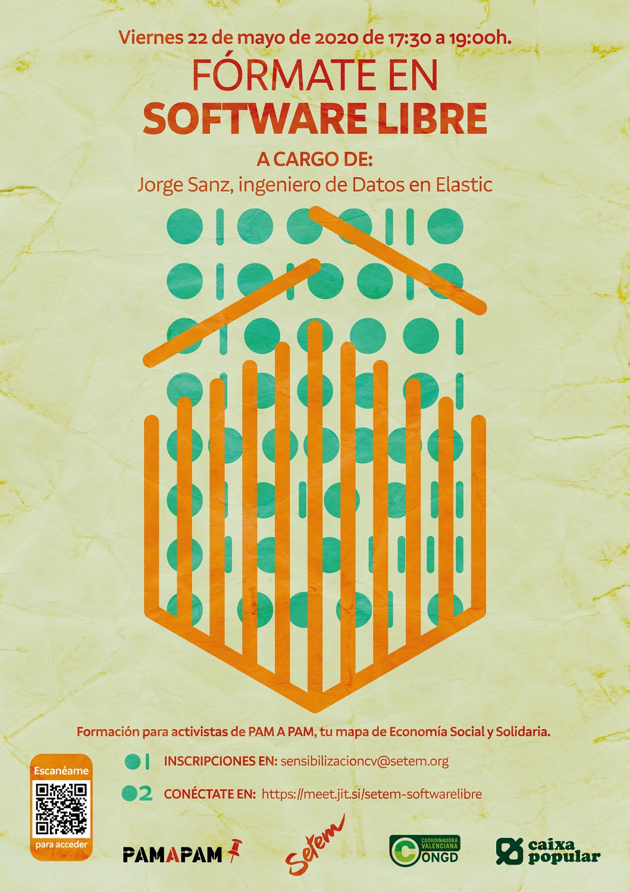

= Software Libre para SETEM

Materiales de charla sobre Software Libre para http://www.setem.org/site/es/comunitat-valenciana[SETEM].

* https://jsanz.github.io/softwarelibre-setem/#/[Diapositivas]
* link:./docs/software-libre.adoc[Artículo]

[#banner]
.Cartel de la actividad
[link=https://raw.githubusercontent.com/jsanz/softwarelibre-setem/master/docs/imgs/banner.jpg]
